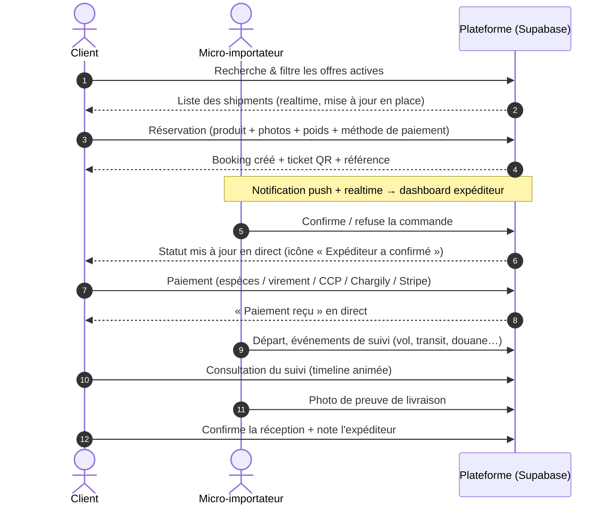
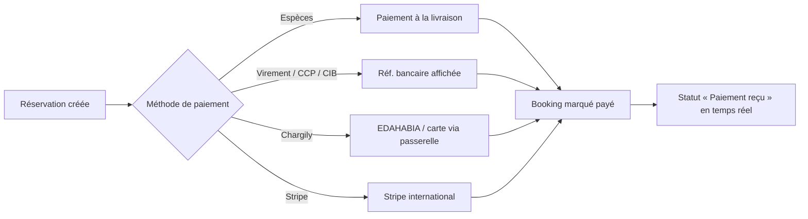
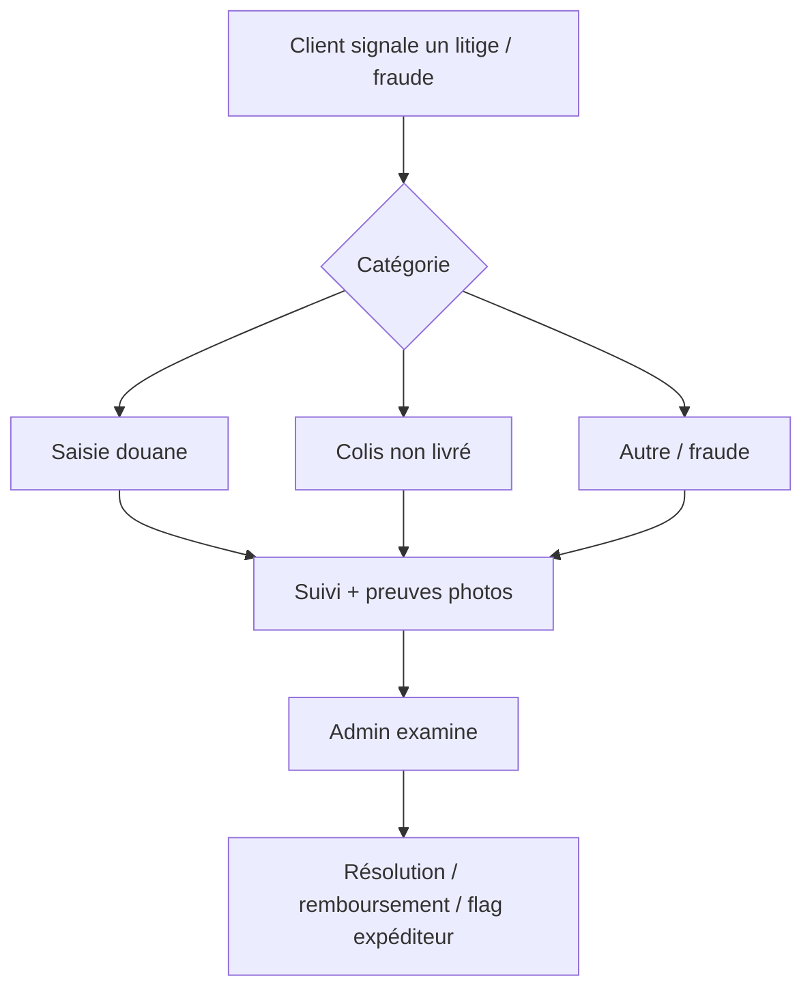
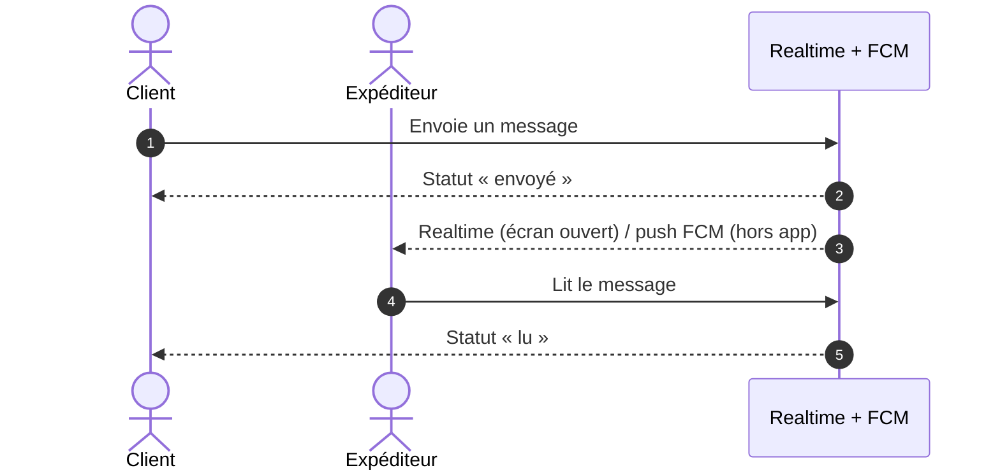
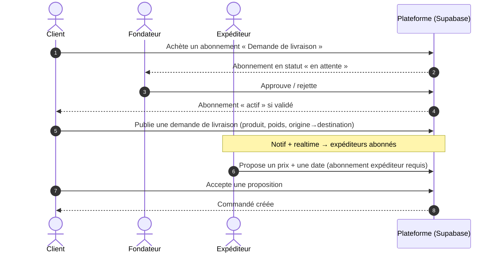

# 📦 CargoLink

> Plateforme mobile type **DHL** qui connecte les **micro-importateurs** (voyageurs avec excédent de bagage) aux **clients** en Algérie pour importer des produits à moindre coût.

| | | |
|---|---|---|
| 🎯 **–50 à –70 %** vs DHL/FedEx | 🇩🇿 Optimisé marché algérien | 🏗 Flutter + Supabase Realtime |

🔗 **Démo web (GitHub Pages)** : https://connacri.github.io/CargoLink/
🔒 **Politique de confidentialité** : https://connacri.github.io/CargoLink/privacy_policy.html
🗑 **Suppression de compte & données** : https://connacri.github.io/CargoLink/account_deletion.html

---

## ✨ Vision

Connecter des **micro-importateurs** (voyageurs disposant d'une franchise bagage) et des **clients** qui veulent importer des produits. Le micro-importateur rentabilise son excédent de bagage, le client paie une fraction du prix des transporteurs classiques.

---

## 🚀 Fonctionnalités

### 🧑 Pour les clients
- 🔍 **Recherche & filtres** : destinations, origine, prix, tri (smart filters).
- 📦 **Assistant de réservation** en 4 étapes : *Produit → Photos → Paiement → Terminé*.
- 🎫 **Confirmation avec QR code** : ticket récapitulatif redessiné (en-tête dégradé « CARGOLINK / Billet de Réservation », pointillés, détails produit) + bouton *« Enregistrer la confirmation »* (sauvegarde en galerie via `RepaintBoundary`).
- 💳 **Paiement** : Espèces, Virement bancaire, CCP/CIB, **Chargily** (EDAHABIA / carte), **Stripe** (international).
- 🗂 **Mes commandes** : deux onglets (*Mes commandes* + *Mes demandes de livraison*), filtres par statut, annulation, icônes de statut, profil expéditeur cliquable, mise à jour en temps réel.
- 📦 **Mes colis** : tuiles enrichies (liseré de couleur, itinéraire, puces statut/poids/prix, badge de paiement) + **dialog de suivi façon billet** (n° de suivi sélectionnable, statut gradient).
- 🛰 **Suivi de colis** : timeline DHL/UPS-style, barre de progression, preuve de livraison photo, confirmation de réception, notation de l'expéditeur.
- 🚚 **Demandes de livraison** : publier une demande (abonnement requis, validé par le fondateur), recevoir des propositions d'expéditeurs, accepter une réponse.
- 🎁 **Programme de parrainage** : code de parrainage, badge, commissions reversées pour chaque colis livré/payé par un filleul.
- 🔗 **Deep links** : `cargolink://offer/<shipmentId>` et `cargolink://referral/<CODE>`.
- 💬 **Chat** avec l'expéditeur (statuts envoyé / délivré / lu, push FCM).
- 🔔 **Notifications** : annonces ciblées + notifications personnelles, badge non-lu, « tout marquer comme lu ».
- ⚖️ **Litiges** : signalement de litige / fraude (saisie douane, colis non livré, etc.).
- ✍️ **Feedback** : signaler un bug en dessinant sur l'écran (BetterFeedback).

### 🧳 Pour les micro-importateurs
- 🪪 **KYC complet** : passeport + **live selfie** (détection de visage ML Kit), dossier modifiable et re-vérifiable.
- 🚢 **Publier des shipments** : poids, prix, destination, numéro de vol, photos.
- 📥 **Gérer les commandes reçues** : confirmée enrichie (répartition par statut, montant total, prochaine date de départ), confirmer / refuser, poids alloué, carte client.
- 🛰 **Mettre à jour le suivi** (événements + points GPS).
- 🚚 **Demandes de livraison** : consulter les demandes des clients et proposer un prix/une date (abonnement requis, validé par le fondateur).
- 💰 **Revenus & statistiques** : tableau de bord, graphique CA, commissions, historique.
- ⭐ **Profil public** : note, avis, badge vérifié.

### 🛡 Pour l'admin / fondateur
- 🔎 **Centre de vérification** KYC (approuver / rejeter / re-vérifier).
- ⚖️ **Litiges & fraudes**, flags expéditeur.
- 💸 **Transactions & commissions**, allocations de paiement, payouts, **portefeuille détaillé** (historique filtrable + recherche).
- 📣 **Broadcasts** ciblés par rôle.
- ✍️ **Feedback inbox** (retours utilisateurs).
- ⚙️ **Paramètres plateforme** redessinés en sections (Tarification, Poids, Parrainage, Abonnements) avec bouton d'enregistrement dans l'en-tête.
- 🎁 **Programme de parrainage** en haut du tableau de bord (récapitulatif + vidéo/paramétrage).
- 📊 **Tableau de bord fondateur enrichi** : cartes Voyageurs/Micro-Importateurs avec données financières (CA/expéditeur, actifs 30 j, commandes en attente, route la plus fréquentée).
- 🗂 **Validation des abonnements** : écran dédié listant les demandes (en attente / actifs / archives) avec Approuver / Rejeter.
- 📈 **Analytics fondateur** (super admin).

### 👤 Pour tous (profil)
- 📋 **Écran « Gérer mon compte »** : informations du compte, sécurité, données personnelles, zone dangereuse (désactivation / suppression avec délai de 30 j) — séparé de l'écran de profil.

---

## 🔄 Workflows

### 1. Cycle de vie d'un envoi (client → expéditeur)



### 2. Workflow de paiement



### 3. Workflow de litige



### 4. Workflow chat



### 5. Workflow demande de livraison + abonnement



---

## 🎨 Animations & UI

- **Entrée en cascade** (`StaggeredEntrance`) : glissement + fondu des cartes de listes, décalage progressif par item.
- **Squelettes shimmer** : chargements de listes fluides (au lieu d'un simple spinner).
- **Icônes animées** (`AnimatedIconDot`) : pastilles pulsantes de statut.
- **Glass cards** + **entêtes en dégradé** (`GradientSliverHeader`) : effet « glassmorphism » moderne.
- **Fade-in au scroll** : apparition douce des sections pendant le défilement.
- **Timeline de suivi animée** : progression par étapes (DHL/UPS/FedEx style).
- **Tickets façon billet** (QR + suivi colis) : en-tête en dégradé « CARGOLINK », diviseurs en pointillés, rendu `RepaintBoundary` pour capture d'écran.
- **Réponse haptique** et transitions Material 3 natives.
- Feedback utilisateur avec **annotation au doigt** (mode dessin).

---

## 🌍 Multilangage

> **État actuel** : l'interface est **entièrement en français** (`Locale('fr')`), avec prise en charge des devise/locale via `intl`.

| Langue | Statut |
|---|---|
| 🇫🇷 Français (UI par défaut) | ✅ Actif |
| 🇬🇧 English | 🔜 Prévu (Phase 3) |
| 🇩🇿 العربية | 🔜 Prévu (Phase 3) |

Le passage au multilangage s'appuiera sur `flutter_localizations` + `gen-l10n` (fichiers `ARB`) sans changement de l'architecture (les chaînes sont déjà centralisées dans les écrans/thème).

---

## 🏗 Stack Technique

**Frontend** — Flutter 3.44 (Dart 3.12) · Riverpod 2.4 (state) · Material 3 · Lottie · shimmer
**Backend** — Supabase (PostgreSQL + Realtime + RLS) · Auth (Email/Google/Apple + pont Firebase) · Storage
**Paiement** — Chargily · Stripe
**Notifications** — Firebase Cloud Messaging + Supabase Realtime (statuts de message)
**Autres** — Google Maps / geolocator · ML Kit (live selfie) · QR (`qr_flutter`) · Galerie (`gal`) · BetterFeedback · deep links (`cargolink://`) · Géo-sélecteurs (pays/ville, aéroports)

---

## 📁 Structure du Projet

```
cargolink/
├── lib/
│   ├── main.dart                          # Point d'entrée (Firebase + FCM + BetterFeedback)
│   ├── app/                               # Shell applicatif, onglets par rôle, widgets globaux
│   ├── core/
│   │   ├── config/                        # supabase_config, firebase_options
│   │   ├── constants/ · enums/ · theme/   # AppTheme, enums (statuts, devises…)
│   │   ├── utils/                         # error_dialog…
│   │   └── widgets/                       # animations, shimmer, glass_card, ui_kit,
│   │                                      #   paginated_list, notification_widgets, chat_widgets…
│   ├── data/
│   │   ├── models/                        # User, Shipper, Shipment, Booking, Notification,
│   │   │                                  #   Chat, Payment, Dispute, Review, Broadcast,
│   │   │                                  #   Delivery (Request/Response/Guarantee/Subscription),
│   │   │                                  #   Referral, utility_models (flags, tokens, logs…)
│   │   └── services/                      # auth, shipper_shipment, booking_payment, tracking_dispute,
│   │                                      #   chat, broadcast, feedback, review, storage, realtime, fcm,
│   │                                      #   delivery, referral, settings…
│   ├── providers/index.dart               # Tous les providers Riverpod (+ pagers + realtime)
│   ├── components/                        # tracking_timeline, shipper_card, revenue_bar_chart
│   └── screens/
│       ├── auth/                          # Login, signup, role selection, KYC gate, vérif email
│       ├── client/                        # Home, booking wizard, my orders (2 onglets), my parcels,
│       │                                  #   delivery request, tracking
│       ├── shipper/                       # Dashboard, registration/live selfie, bookings, stats,
│       │                                  #   delivery browse (proposer)
│       ├── chat/                          # Conversations + chat
│       ├── profile/                       # Profil utilisateur + Gérer mon compte
│       │                                  #   (désactivation / suppression)
│       └── admin/                         # Vérification, litiges, transactions, broadcasts, settings,
│                                          #   références (Réf), gestion abonnements, wallet détail…
├── .github/workflows/                     # deploy.yml (web) + release.yml (AAB signé versionné)
└── pubspec.yaml
```

---

## 🗄 Base de données (Supabase)

**Tables principales** : `users` · `shippers` · `shipments` · `bookings` · `shipment_tracking` · `shipment_events` · `shipment_proofs` · `payments` · `payment_allocations` · `payouts` · `platform_fees` · `disputes` · `claims` · `notifications` · `messages` · `conversations` · `reviews` · `broadcasts` · `feedback` · `shipper_flags` · `tracking_points` · `trips` · `device_tokens` · `delivery_requests` · `delivery_responses` · `delivery_guarantees` · `delivery_subscriptions` · `referral_codes` · `referrals` · `referral_earnings` · `referral_batches` · `transfer_tokens` · `delivery_attempts` · `audit_logs` · `device_keys` · `platform_settings` · `account_deletion_requests` · `deleted_accounts`

> 📦 **Modèles Dart alignés** : toutes les tables Supabase ont leur classe Dart correspondante (dont `ShipperFlag`, `DeviceToken`, `TransferToken`, `DeliveryAttempt`, `AuditLog`, `DeviceKey`, `PlatformSetting`, `ReferralCode`, `DeliverySubscription`, etc.).

**Sécurité & Realtime**
- ✅ RLS activé sur toutes les tables, policies par rôle (client / micro-importateur / admin).
- ✅ Triggers `SECURITY DEFINER` protégés (réservation de poids, allocations).
- ✅ Publication **realtime** activée sur les tables métier (`supabase_realtime`) — listes mises à jour **en place** (patch des tiles) sans rechargement complet.
- ✅ Récupération automatique des canaux realtime (backoff exponentiel sur erreurs/expiration).

**Storage Buckets** : `profiles` · `documents` · `bookings` · `proofs`

---

## 🔐 Setup complet

### 1. Supabase
1. Créez un projet sur [supabase.com](https://supabase.com).
2. Dans **SQL Editor**, exécutez le script de schéma (tables + RLS + triggers).
3. **Authentication → Providers** : activez Email/Password + Google/Apple si souhaité.
4. **Storage → Buckets** : créez `profiles`, `documents`, `bookings`, `proofs`.
5. **Realtime → Tables** : activez `supabase_realtime` sur les tables métier.

### 2. Clé API
La clé n'est volontairement **pas committée** (secret). Pour la fournir à l'app :

```bash
# Windows (PowerShell)
flutter run --dart-define=SUPABASE_ANON_KEY=VOTRE_CLE_ANON
# Build APK
flutter build apk --release --dart-define=SUPABASE_ANON_KEY=VOTRE_CLE_ANON
```

L'URI du projet est préconfigurée dans `lib/core/config/supabase_config.dart`.

### 3. Flutter
```bash
flutter pub get
flutter analyze
flutter test
```

---

## 🔌 Exemples d'API

```dart
// Inscription
await authService.signUpWithEmail(email: e, password: p, fullName: n, phone: tel, role: 'client');

// Recherche de shipments actifs
final board = await shipmentService.getActiveShipments(destinationCity: 'Alger', originCountry: 'Turquie');

// Créer une réservation (assistant)
final booking = await bookingService.createBooking(shipmentId: s.id, clientId: uid, productName: 'iPhone 15',
    productDescription: 'Neuf scellé', productPhotosUrl: urls, requestedWeightKg: 0.8);

// Écouter les changements d'une table (mise à jour en place des listes)
ref.watch(tableChangesProvider(('bookings', 'client_id', uid)));

// Suivi temps réel
trackingService.listenToTrackingUpdates(bookingId).listen((updates) { /* mise à jour UI */ });

// Litige
await disputeService.createDispute(bookingId: b.id, reportedByUserId: uid, type: 'customs_seizure', description: '...');
```

---

## 🧪 Tests & Qualité

```bash
flutter analyze   # 0 erreur, 0 avertissement
flutter test      # tests unitaires des modèles
```

Tests unitaires couverts : modèles (`User.fromJson`, `Shipment.isActive`, `remainingWeightKg`, …).
Tests RLS exécutés en base : création de booking client ✅ · trigger poids réservé ✅ · shipper voit/confirme un booking ✅ · shipper insert tracking ✅ · admin gère les litiges ✅ · client crée un litige ✅ · client ne peut **pas** altérer le shipment d'un tiers ✅ · falsification de booking refusée ✅.

---

## 🛠 Commandes de Build locales

```bash
# Android (APK release)
flutter build apk --release
# Android AppBundle (Play Store)
flutter build appbundle --release
# Web
flutter build web --release
# Windows (desktop)
flutter build windows --release
```

> **Statut build** : Android, Windows et Web compilent et sont automatisés en CI (voir ci-dessous).

---

## 🤖 CI / GitHub Actions

### Deploy (Web → GitHub Pages)
`.github/workflows/deploy.yml` — déclenché sur chaque push vers `master` : build Flutter web avec la clé anon (secret) puis déploiement GitHub Pages.

### Release versionnée
`.github/workflows/release.yml` — build **App Bundle (.aab) signé** (format Play Console) + **site web**, version bump + **tag** + **GitHub Release**. Le `app-release.aab` est publié en GitHub Release puis déposé dans la Play Console (test interne → fermé → production).

**Secrets GitHub à configurer** (Settings → Actions → Secrets → New repository secret) :

| Secret | Contenu | Usage |
|---|---|---|
| `KEYSTORE_BASE64` | Keystore `cargolink-release.jks` encodé en **base64** | Signature APK |
| `KEYSTORE_PASSWORD` | Mot de passe du keystore | Signature APK |
| `KEYSTORE_KEY_ALIAS` | Alias de la clé | Signature APK |
| `KEY_PASSWORD` | Mot de passe de la clé | Signature APK |
| `SUPABASE_ANON_KEY` | Clé **anon** Supabase | Compilée dans l'APK/web/Windows |

**Générer le keystore (une fois) :**
```bash
keytool -genkeypair -v -keystore cargolink-release.jks -alias cargolink \
  -keyalg RSA -keysize 2048 -validity 10000 \
  -storepass VOTRE_STORE_PASS -keypass VOTRE_KEY_PASS \
  -dname "CN=CargoLink, OU=Dev, O=CargoLink, L=Alger, S=Alger, C=DZ"
# Encodage base64 (PowerShell)
[Convert]::ToBase64String([IO.File]::ReadAllBytes("cargolink-release.jks"))
# Collez le résultat dans le secret KEYSTORE_BASE64
```

> ⚠️ Ne committez jamais le fichier `.jks` ni les mots de passe.

**Secrets Supabase (Edge Functions)** :

| Secret | Contenu | Usage |
|---|---|---|
| `FIREBASE_WEB_API_KEY` | Clé API web Firebase | Vérification des tokens Firebase (delete-account, admin-reset, auth-exchange-firebase) |
| `FIREBASE_SERVICE_ACCOUNT` | Compte de service Firebase (JSON, bouton « Générer une nouvelle clé privée » dans Firebase Console → Comptes de service) | Suppression du compte dans Firebase Auth **et** authentification FCM HTTP v1 pour les notifications push (send-push, delete-account, broadcast) |

> ℹ️ **Resend et FCM_SERVER_KEY sont abandonnés** : plus aucune notification par e-mail (les e-mails utilisent Firebase Auth directement), et Google a déprécié la Legacy FCM Server Key — les push passent par l'API FCM HTTP v1 via le compte de service. Seul `FIREBASE_SERVICE_ACCOUNT` est requis pour les notifications.

Configurer via la CLI : `supabase secrets set NOM_SECRET=...`

---

## 🗺 Roadmap

| Phase | Statut |
|---|---|
| MVP mobile (client / micro-importateur / admin) | ✅ |
| Paiement (Chargily + Stripe) | ✅ intégré |
| Notifications push (FCM) + statuts de message | ✅ |
| QR de confirmation + sauvegarde galerie | ✅ |
| Mise à jour temps réel sans redémarrage (patch pagers) | ✅ |
| Programme de parrainage (code, badge, commissions) | ✅ |
| Demande de livraison + abonnements (validation fondateur) | ✅ |
| Deep links (offres / parrainage) | ✅ |
| Écran « Gérer mon compte » | ✅ |
| Web dashboard + CI/CD releases (AAB signé) | ✅ automatisé |
| Multi-langues (FR/EN/AR) | 🔜 Phase 3 |

---

## 📄 License

MIT © 2026 — CargoLink